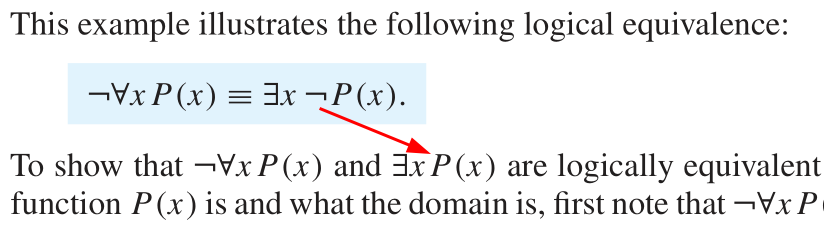

[Go back to the main page](https://github.com/world-class/REPL)

# Table of contents
<!-- vim-markdown-toc GFM -->

* [Discrete Mathematics - Reported problems](#discrete-mathematics---reported-problems)
    * [Additional resources](#additional-resources)
        * [Rosen, K.H. Discrete mathematics and its applications. (New York: McGraw-Hill, 2012) 7th edition [ISBN 978-0073383095]](#rosen-kh-discrete-mathematics-and-its-applications-new-york-mcgraw-hill-2012-7th-edition-isbn-978-0073383095)
            * [Page 46](#page-46)

<!-- vim-markdown-toc -->

# Discrete Mathematics - Reported problems
This page is about the [Discrete Mathematics module](../../../modules/level_4/discrete_mathematics/).

## Additional resources
### Rosen, K.H. Discrete mathematics and its applications. (New York: McGraw-Hill, 2012) 7th edition [ISBN 978-0073383095]
#### Page 46
The negation symbol (**¬**) is missing where the red arrow is pointing.

