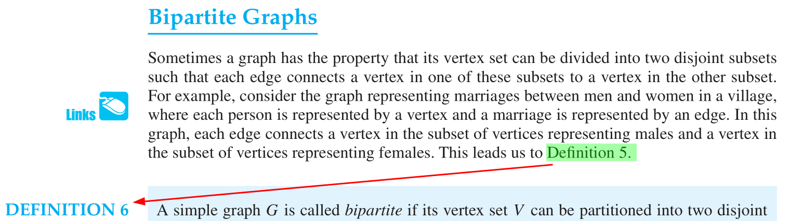

[Go back to the main page](../../../README.md)

# Table of contents

- [Table of contents](#table-of-contents)
- [Discrete Mathematics - Reported problems](#discrete-mathematics---reported-problems)
  - [Week 10](#week-10)
    - [5.212 Domino logic gates simulation](#5212-domino-logic-gates-simulation)
      - [Firefox browser](#firefox-browser)
  - [Additional resources](#additional-resources)
    - [Rosen, K.H. Discrete mathematics and its applications. (New York: McGraw-Hill, 2012) 7th edition [ISBN 978-0073383095]](#rosen-kh-discrete-mathematics-and-its-applications-new-york-mcgraw-hill-2012-7th-edition-isbn-978-0073383095)
      - [Page 46](#page-46)
      - [Page 656](#page-656)

# Discrete Mathematics - Reported problems

This page is about the [Discrete Mathematics module](../../../modules/level_4/discrete_mathematics/).

## Week 10

### 5.212 Domino logic gates simulation

#### Firefox browser

If the simulation fails to load, it can occur due to the hardware acceleration option being disabled. To enable it, go to the preferences (you can type `about:preferences` in the URL bar): then, under **General** tab, search for **Performance** and uncheck the option `Use recommended performance settings`. By doing so, the option `Use hardware acceleration when available` will appear below it. Make sure it is enabled for this domino simulation. For more information on browser compatibility and how to fix possible issues, see [this answer](https://superuser.com/a/836833/1032549) on Superuser.com.

---

## Additional resources

### Rosen, K.H. Discrete mathematics and its applications. (New York: McGraw-Hill, 2012) 7th edition [ISBN 978-0073383095]

#### Page 46

The negation symbol (**¬**) is missing where the red arrow is pointing.

#### Page 656

The definition being referred to should be _Definition 6_, **not** _Definition 5_.

