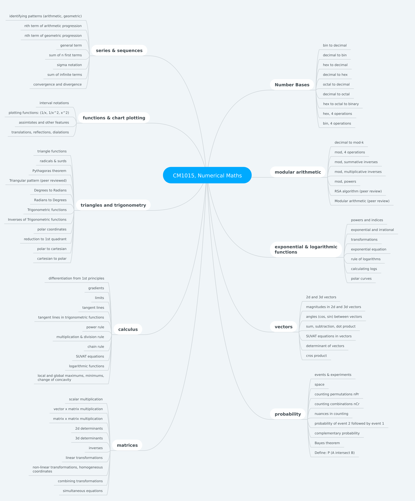

[Go back to the main page](https://github.com/world-class/REPL)

# Table of contents
<!-- vim-markdown-toc GFM -->

* [Numerical Mathematics](#numerical-mathematics)
* [Topics covered](#topics-covered)
* [Assessment](#assessment)
* [Overview of the module (mind map)](#overview-of-the-module-mind-map)
* [Resources](#resources)
    * [All the essential readings](#all-the-essential-readings)
    * [Examples of past exams](#examples-of-past-exams)
    * [Kinks to be aware of](#kinks-to-be-aware-of)
    * [On REPL (see relevant sections)](#on-repl-see-relevant-sections)
    * [Reference books](#reference-books)
    * [Syllabus](#syllabus)
    * [Useful formulae](#useful-formulae)
        * [On summation](#on-summation)

<!-- vim-markdown-toc -->

---

# Numerical Mathematics
This module helps hone your skills in thinking abstractly. It also
introduces you to many of the standard continuous models used to
help understand and design computational systems. You will develop
the fundamental numerical mathematical tools that will support you
during the BSc degree. Particular attention is paid to notions of
experimentation, reasoning and generalisation. You'll learn many
of the numerical mathematical concepts and techniques that underpin
computer science. In particular, you'll study number systems, special
functions, graphing and linear algebra.

Enrolled students only: [Course syllabus available on Coursera](https://www.coursera.org/learn/london-cs-orientation/supplement/Yk0uo/syllabus-numerical-mathematics-cm1015).

# Topics covered

- Number bases and modular arithmetic
- Sequences and Series
- Graph Sketching and Kinematics
- Angles, Triangles and Trigonometry
- Trigonometric functions
- Exponential and logarithmic functions
- Calculus: Limits and differentiation
- Vectors and Matrices
- Linear Transformations
- Introduction to Combinatorics and Probability

# Assessment

One two hour unseen written examination and coursework (Type I)

# Overview of the module (mind map)

# Resources
## All the essential readings
| Week | Book | Topics |
| ---- | ---- | ------ |
| 1 | Foundational Maths | Chapter 14 Number bases |
| 3 | Number theory for computing | Chapter 1 Theory of divisbility (Section 1.2.1) |
| 3 | Number theory for computing | Chapter 1 Theory of congruences (sections 1.6.1, 1.6.2 and 1.6.3) |
| 4 | Foundational Maths | Chapter 12 Sequences and series |
| 4 | Precalculus with limits | Chapter 9 Sequences, series and probability (sections 9.1, 9.2 and 9.3) |
| 6 | Foundational Maths | Chapter 16 Functions |
| 6 | Foundational Maths | Chapter 17 Graphs of functions |
| 6 | Foundational Maths | Chapter 18 The straight line |
| 6 | Mathematics for computer graphics | Chapter 5 Cartesian coordinates |
| 6 | Precalculus with limits | Chapter 1 Functions and their graphs (sections 1.1–1.8) |
| 6 | Precalculus with limits | Chapter 2 Polynomial and rational functions (sections 2.1–2.3 and 2.6) |
| 6 | A Level Physics | Chapter 3 Motion (sections 3.1–3.7) |
| 7 | Foundational Maths | Chapter 21 Measurement (as revision) |
| 7 | Foundational Maths | Chapter 22 Introduction to trigonometry |
| 7 | Foundational Maths | Chapter 25 Solution of triangles, sections 25.1 - 25.5 |
| 8 | Mathematics for computer graphics | Chapter 4 Trigonometry (sections 4.1–4.6) |
| 9 | Foundational Maths | Chapter 23 The trigonometrical functions and their graphs |
| 9 | Foundational Maths | Chapter 24 Trigonometrical identities and equations (except for table 24.1) |
| 9 | Precalculus with limits | Chapter 4 Trigonometry |
| 9 | Precalculus with limits | Chapter 5 Analytic trigonometry (section 5.3) |
| 9 | Precalculus with limits | Chapter 6 Additional topics in trigonometry (sections 6.1 and 6.2) |
| 10 | Foundational Maths | Chapter 23 The trigonometrical functions and their graphs, section 23.2 |
| 10 | Precalculus with limits | Chapter 4 Trigonometry (sections 4.5 and 4.6, relating to transformations of graphs) |
| 10 | Precalculus with limits | Chapter 10 Topics in analytic geometry (section 10.7, relating to polar coordinates) |
| 11 | Foundational Maths | Chapter 19 The exponential function |
| 11 | Precalculus with limits | Chapter 1 Functions and their graphs (section 1.9) |
| 11 | Precalculus with limits | Chapter 3 Exponential and logarithmic functions |
| 12 | Foundational Maths | Chapter 20 The logarithm function |
| 13 | Foundational Maths | Chapter 34 Gradients of curves |
| 13 | Foundational Maths | Chapter 35 Techniques of differentiation |
| 13 | Precalculus with limits | Chapter 12 Limits and an introduction to calculus |
| 14 | Foundational Maths | Chapter 35 Techniques of differentiation |
| 15 | Foundational Maths | Chapter 26 Vectors |
| 15 | Foundational Maths | Chapter 27 Matrices |
| 15 | Mathematics for computer graphics | Chapter 6 Vectors (sections 6.1 and 6.2, pp.31-49) |
| 15 | Precalculus with limits | Chapter 6 Additional topics in trigonometry (sections 6.3 and 6.4) |
| 15 | Precalculus with limits | Chapter 8 Matrices and determinants |
| 15 | Precalculus with limits | Chapter 11 Analytic geometry in three dimensions |
| 16 | Mathematics for computer graphics | Chapter 6 Vectors |
| 17 | Mathematics for computer graphics | Chapter 7 Transformation (sections 7.1-7.3) |
| 19 | Foundational Maths | Chapter 31 Probability |
| 19 | Precalculus with limits | Chapter 9 Sequences, series and probability (sections 9.6 and 9.7) |
| 20 | Foundational Maths | Chapter 30 Statistics |

## Examples of past exams
- [Past exam papers in Computing](https://www.whatdotheyknow.com/request/past_exam_papers_in_computing_2) - The relevant files for this module are `IS51026A_2015.pdf`, `IS51026A_2016.pdf`, `IS51026A_2017.pdf` and `IS51026B_2018.pdf`.

## Kinks to be aware of
- [List of reported errors and bugs with the module](../../../kinks/level4/numerical_mathematics/).

## On REPL (see relevant sections)
- [YouTube](../../../youtube/)
- [Websites](../../../websites/)

## Reference books
- [Foundation Maths](https://www.dawsonera.com/abstract/9781292095196), Sixth Edition, by Anthony Croft and Robert Davidson.
- [Mathematics for Computer Graphics](https://www.dawsonera.com/abstract/9781846282836), Second Edition, by John Vince.
- [Precalculus with Limits](https://www.dawsonera.com/abstract/9781337516853), Fourth Edition, by Ron Larson.
- A Level Physics - Required reading provided on Coursera platform
- Number theory for computing - Required reading provided on Coursera platform.

## Syllabus
- [Syllabus PDF](./resources/NM-Syllabus.pdf)

## Useful formulae
### On summation

